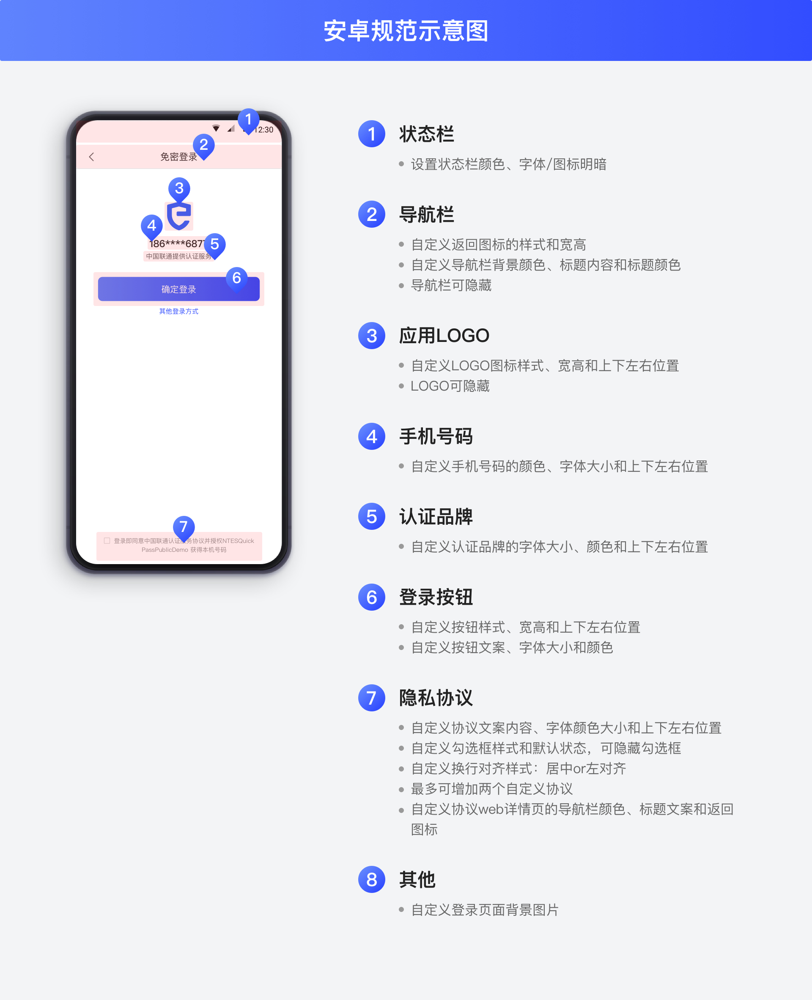
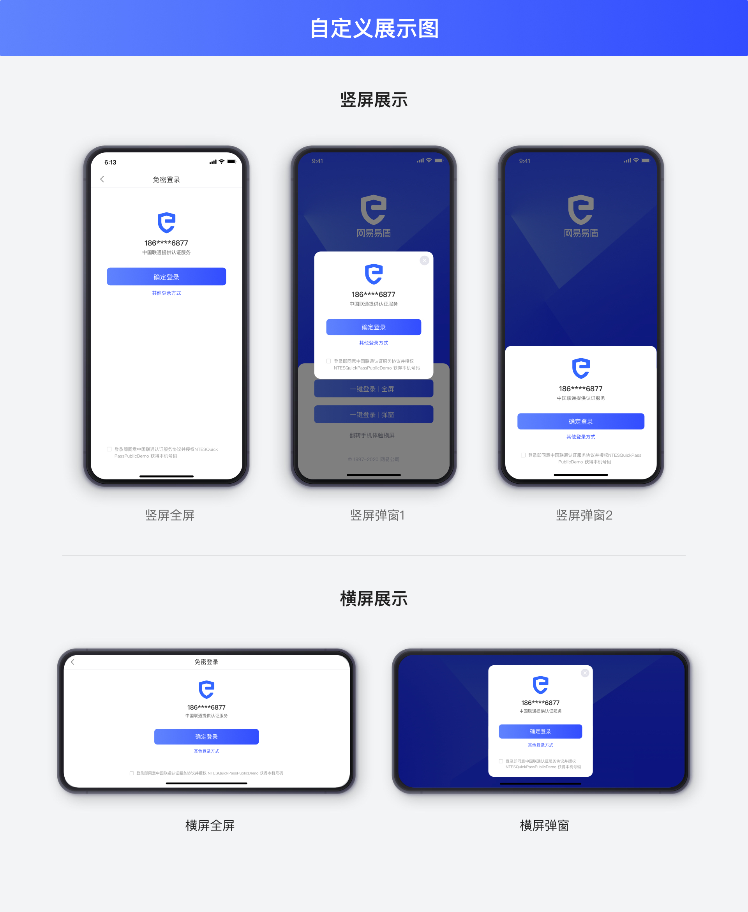

## SDK说明
一键登录SDK提供移动，电信以及联通的一键登录及本机校验功能
## SDK集成
### 1、添加aar包依赖
将从官网下载下来的一键登录aar包放到项目的libs目录下，然后在模块的build.gradle中的dependencies添加相关依赖

示例：

```
dependencies {
    implementation(name: 'quicklogin-external-release', ext: 'aar') // aar包具体名称请以官网下载下来为准
    implementation(name: 'CMCCSSOSDK-release', ext: 'aar')
    implementation(name: 'Ui-factory_oauth_mobile_3.8.3', ext: 'aar')
    implementation(name: 'CTAccount_sdk_api_v3.7.0_all', ext: 'aar')
    implementation 'com.google.code.gson:gson:2.8.5'    // 配置对gson的依赖
}
```
然后在app的build.gradle的android下添加

```
 repositories {
        flatDir {
            dirs 'libs'
        }
    }
```

## SDK接口
### QuickLogin
本机校验和一键登录功能的提供类，主要提供获取单例，预取号，本机校验/一键登录，设置预取url等接口
#### 1 获取QuickLogin单例

```
QuickLogin login = QuickLogin.getInstance(getApplicationContext(), BUSINESS_ID);// BUSINESS_ID为从易盾官网申请的业务id
```

#### 2 预取号（一键登录前请务必先调用该接口获取手机掩码）

```
login.prefetchMobileNumber(new QuickLoginPreMobileListener() {
        @Override
        public void onGetMobileNumberSuccess(String YDToken, final String mobileNumber) {
         // 注:对于3网UI统一版本SDK，即2.0.0及以后版本，直接在该回调中调用取号接口onePass即可
        }

        @Override
        public void onGetMobileNumberError(String YDToken, final String msg) {
        
        }
    });
```
**NOITE**:对于移动和联通而言因必须使用运营商界面，onGetMobileNumberSuccess回调中mobileNumber形参值为null，无需关心该值内容，直接在该回调中调用取号接口onePass即可展示一键登录界面并自动显示掩码mobileNumber

#### 3 一键登录

**NOITE**:调用一键登录接口前请务必调用预取号接口，在预取号接口的成功回调中调用一键登录接口，获取运营商授权码与易盾token  
API定义：

```
 /**
 * 一键登录功能，使用该接口前需要先调用fetchPreviewMobileNumber接口进行预取号
 *
 * @param listener 回调监听器
 */
public void onePass(final QuickLoginTokenListener listener)
```
使用示例

```
login.onePass(new QuickLoginTokenListener() {
    @Override
    public void onGetTokenSuccess(final String YDToken, final String accessCode) {
        Log.d(TAG, String.format("yd token is:%s accessCode is:%s", YDToken, accessCode));
        tokenValidate(YDToken, accessCode, true);
    }

    @Override
    public void onGetTokenError(String YDToken, String msg) {
        Log.d(TAG, "获取运营商授权码失败:" + msg);
    }
});

```

#### 4 本机校验
API定义：
```
public void getToken(final String mobileNumber, final QuickLoginTokenListener listener)
```
第一个参数表示用户输入的进行本机校验的手机号码，第二个参数是获取token的回调监听器    
使用示例：

```
  login.getToken(mobileNumber, new QuickLoginTokenListener() {
            @Override
            public void onGetTokenSuccess(final String YDToken, final String accessCode) {
                runOnUiThread(new Runnable() {
                    @Override
                    public void run() {
                        Log.d(TAG, "获取Token成功" + YDToken + accessCode);
                        tokenValidate(YDToken, accessCode, false);
                    }
                });
            }

            @Override
            public void onGetTokenError(final String YDToken, final String msg) {
                runOnUiThread(new Runnable() {
                    @Override
                    public void run() {
                        Toast.makeText(getApplicationContext(), "获取Token失败" + YDToken + msg, Toast.LENGTH_LONG).show();
                    }
                });

            }
        });
```
#### 5判断运营商类型

```
/**
* @param context
* @return int类型，标识运营商类型，具体含义如下
* 1:      电信
* 2:      移动
* 3:      联通
* 5:      未知
*/
public int getOperatorType(Context context) 
```
#### 6 其他接口

```
public void setPreCheckUrl(String url) // 设置预取url接口
public void setExtendData(JSONObject extendData) // 设置扩展数据
public boolean onExtendMsg(JSONObject extendMsg) // 当用户自定义预取Url后，如果在自己业务后端判断调用非法，可直接调用该接口返回false实现快速降级，以及获取自己业务后端处理后返回的数据
public void setUnifyUiConfig(UnifyUiConfig uiConfig) // 设置一键登录页面自定义属性，详细可配置信息{@link UnifyUiConfig#Builder}
public void setPrefetchNumberTimeout(int timeout) // 设置预取号超时时间，单位s
public void setFetchNumberTimeout(int timeout)    // 设置取号超时时间，单位s
```


### QuickLoginPreMobileListener
预取号的回调监听器，接入者需要实现该接口的如下2个抽象方法

```
public abstract class QuickLoginPreMobileListener implements QuickLoginListener {
     /**
     * @param YDToken      易盾Token
     * @param mobileNumber 获取的手机号码掩码
     */
    void onGetMobileNumberSuccess(String YDToken, String mobileNumber);

    /**
     * @param YDToken 易盾Token
     * @param msg     获取手机号掩码失败原因
     */
    void onGetMobileNumberError(String YDToken, String msg);
    
     /**
     * 业务方自定义PreCheck后，业务方扩展字段的回调，
     * 返回false表示业务方希望中断sdk后续流程处理，直接降级
     *
     * @param extendMsg
     * @return 返回true表示继续后续处理，返回false表示业务方希望降级终止后续处理，默认返回true
     */
     boolean onExtendMsg(JSONObject extendMsg);
}
```
### QuickLoginTokenListener
一键登录或本机校验的获取运营商accessToken的回调监听器，接入者需要实现该接口的如下2个抽象方法

```
public abstract class QuickLoginTokenListener implements QuickLoginListener {
   /**
     * @param YDToken    易盾token
     * @param accessCode 运营商accessCode
     */
    void onGetTokenSuccess(String YDToken, String accessCode);

    /**
     * @param YDToken 易盾token
     * @param msg     出错提示信息
     */
    void onGetTokenError(String YDToken, String msg);
    
     /**
     * 业务方自定义PreCheck后，业务方扩展字段的回调，
     * 返回false表示业务方希望中断sdk后续流程处理，直接降级
     *
     * @param extendMsg
     * @return 返回true表示继续后续处理，返回false表示业务方希望降级终止后续处理，默认返回true
     */
    boolean onExtendMsg(JSONObject extendMsg);
}
```

## 使用步骤
### 1创建QuickLogin对象实例

```
QuickLogin login = QuickLogin.getInstance(getApplicationContext(),
```

### 2根据本机校验或一键登录需求调用对应的接口
#### 2.1 一键登录
##### 2.1.1 调用prefetchMobileNumber接口预取号

```
login.prefetchMobileNumber(new QuickLoginPreMobileListener() {
        @Override
        public void onGetMobileNumberSuccess(String YDToken, final String mobileNumber) {
        // 在该成功回调中直接调用onePass接口进行一键登录即可
        }

        @Override
        public void onGetMobileNumberError(String YDToken, final String msg) {
        //  在该错误回调中能够获取到此次请求的易盾token以及预取号获取手机掩码失败的原因
        }
        @Override
        public boolean onExtendMsg(JSONObject extendMsg) {
           Log.d(TAG, "获取的扩展字段内容为:" + extendMsg.toString());
           // 如果接入者自定义了preCheck接口，可在该方法中通过返回true或false来进行控制是否快速降级
           return super.onExtendMsg(extendMsg);
        }
    });
```
##### 2.1.2 调用onePass一键登录

```
login.onePass(new QuickLoginTokenListener() {
    @Override
    public void onGetTokenSuccess(final String YDToken, final String accessCode) {
        Log.d(TAG, String.format("yd token is:%s accessCode is:%s", YDToken, accessCode));
        // 在一键登录获取token的成功回调中使用易盾token和运营商token去做token的验证，具体验证规则请参看服务端给出的说明文档
        tokenValidate(YDToken, accessCode, true);
    }

    @Override
    public void onGetTokenError(String YDToken, String msg) {
        Log.d(TAG, "获取运营商token失败:" + msg);
        // 一键登录获取token失败的回调
    }
});
```
#### 2.2 本机校验
##### 调用getToken接口进行本机校验

```
// 本机校验获取token
login.getToken(mobileNumber, new QuickLoginTokenListener() {
    @Override
    public void onGetTokenSuccess(final String YDToken, final String accessCode) {
        runOnUiThread(new Runnable() {
            @Override
            public void run() {
                Toast.makeText(getApplicationContext(), "获取Token成功" + YDToken + accessCode, Toast.LENGTH_LONG).show();
                Log.d(TAG, "获取Token成功" + YDToken + accessCode);
                tokenValidate(YDToken, accessCode, false);
            }
        });

    }

    @Override
    public void onGetTokenError(final String YDToken, final String msg) {
        runOnUiThread(new Runnable() {
            @Override
            public void run() {
                Toast.makeText(getApplicationContext(), "获取Token失败" + YDToken + msg, Toast.LENGTH_LONG).show();
            }
        });

    }
    @Override
    public boolean onExtendMsg(JSONObject extendMsg) {
        Log.d(TAG, "获取的扩展字段内容为:" + extendMsg.toString());
        // 如果接入者自定义了preCheck接口，可在该方法中通过返回true或false来进行控制是否快速降级
        return super.onExtendMsg(extendMsg);
    }
});
```
#### 2.3 使用自定义preCheck接口与扩展字段功能
如果接入者需要接管preCheck过程做自己的一些业务逻辑，可以使用如下方式
```
login.setPreCheckUrl(customUrl); // 使用自定义url代理preCheck接口
JSONObject extData = new JSONObject();
        try {
            extData.put("parameter1", "param1");
            extData.put("parameter2", "param2");
        } catch (JSONException e) {
            e.printStackTrace();
        }
login.setExtendData(extData); // 如果自定义url需要接受一些自己的业务参数，通过该接口进行设置
```
## 自定义登录界面属性
由于运营商的要求，一键登录必须使用运营商的登录界面，为此我们提供了一些开放接口用来让您在运营商界面的基础上进行相关UI元素的调整与配置。

### 1. 设计规范
#### 1.1 规范示意图


#### 1.2  易盾自定义展示样例


### 2. 自定义UI配置接口

#### 2.1 UI设置接口

```
public void setUnifyUiConfig(UnifyUiConfig uiConfig)
```

uiConfig表示3网统一的UI配置对象，以下是一个简单示例：

```
QuickLogin.getInstance(getApplicationContext(),onePassId).setUnifyUiConfig(QuickLoginUiConfig.getUiConfig(getApplicationContext()));
```

详细UI配置示例可参考Demo代码示例中QuickLoginUiConfig类代码

#### 2.2 可配置元素及其接口

**注意：**

- 以下所有API接口中涉及到图片，样式等资源名称的形参，均表示资源名，且该资源需要放置在drawable目录下，以设置导航栏图标接口为例：

  ```
  setNavigationIcon(String backIcon) 
  ```

  假设在drawable目录下有back_icon.jpg，则该值为"back_icon"

- 以下所有API接口中如果涉及到顶部偏移和底部偏移的接口，顶部都是相对标题栏底部而言，底部都是相对屏幕底部而言

##### 2.2.1 状态栏

| 方法                                              | 说明                                   |
| ------------------------------------------------- | -------------------------------------- |
| setStatusBarColor(int statusBarColor)             | 设置状态栏颜色                         |
| setStatusBarDarkColor(boolean statusBarDarkColor) | 设置状态栏字体图标颜色是否为暗色(黑色) |

##### 2.2.2 导航栏

| 方法                                              | 说明                                                         |
| :------------------------------------------------ | ------------------------------------------------------------ |
| setNavigationIcon(String backIcon)                | 设置导航栏返回图标，backIcon 导航栏图标名称，需要放置在drawable目录下， |
| setNavigationBackIconWidth(int backIconWidth)     | 设置导航栏返回图标的宽度                                     |
| setNavigationBackIconHeight(int backIconHeight)   | 设置导航栏返回图标的高度                                     |
| setNavigationBackgroundColor(int backgroundColor) | 设置导航栏背景颜色                                           |
| setNavigationTitle(String title)                  | 设置导航栏标题                                               |
| setNavigationTitleColor(int titleColor)           | 设置导航栏标题颜色                                           |
| setHideNavigation(boolean isHideNavigation)       | 设置是否隐藏导航栏                                           |

##### 2.2.3应用Logo

| 方法                                        | 说明                                                         |
| :------------------------------------------ | ------------------------------------------------------------ |
| setLogoIconName(String logoIconName)        | 设置应用logo图标，logoIconName：logo图标名称，需要放置在drawable目录下 |
| setLogoWidth(int logoWidth)                 | 设置应用logo宽度，单位dp                                     |
| setLogoHeight(int logoHeight)               | 设置应用logo高度，单位dp                                     |
| setLogoTopYOffset(int logoTopYOffset)       | 设置logo顶部Y轴偏移，单位dp                                  |
| setLogoBottomYOffset(int logoBottomYOffset) | 设置logo距离屏幕底部偏移，单位dp                             |
| setLogoXOffset(int logoXOffset)             | 设置logo水平方向的偏移，单位dp                               |
| setHideLogo(boolean hideLogo)               | 设置是否隐藏Logo                                             |

##### 2.2.4手机掩码

| 方法                                                    | 说明                                 |
| :------------------------------------------------------ | ------------------------------------ |
| setMaskNumberColor(int maskNumberColor)                 | 设置手机掩码颜色                     |
| setMaskNumberSize(int maskNumberSize)                   | 设置手机掩码字体大小                 |
| setMaskNumberTopYOffset(int maskNumberTopYOffset)       | 设置手机掩码顶部Y轴偏移，单位dp      |
| setMaskNumberBottomYOffset(int maskNumberBottomYOffset) | 设置手机掩码距离屏幕底部偏移，单位dp |
| setMaskNumberXOffset(int maskNumberXOffset)             | 设置手机掩码水平方向的偏移，单位dp   |

##### 2.2.5认证品牌

| 方法                                            | 说明                                 |
| :---------------------------------------------- | ------------------------------------ |
| setSloganSize(int sloganSize)                   | 设置认证品牌字体大小                 |
| setSloganColor(int sloganColor)                 | 设置认证品牌颜色                     |
| setSloganTopYOffset(int sloganTopYOffset)       | 设置认证品牌顶部Y轴偏移，单位dp      |
| setSloganBottomYOffset(int sloganBottomYOffset) | 设置认证品牌距离屏幕底部偏移，单位dp |
| setSloganXOffset(int sloganXOffset)             | 设置认证品牌水平方向的偏移，单位dp   |

##### 2.2.6登录按钮

| 方法                                                   | 说明                                                 |
| :----------------------------------------------------- | ---------------------------------------------------- |
| setLoginBtnText(String loginBtnText)                   | 设置登录按钮文本                                     |
| setLoginBtnTextSize(int loginBtnTextSize)              | 设置登录按钮文本字体大小                             |
| setLoginBtnTextColor(int loginBtnTextColor)            | 设置登录按钮文本颜色                                 |
| setLoginBtnWidth(int loginBtnWidth)                    | 设置登录按钮宽度，单位dp                             |
| setLoginBtnHeight(int loginBtnHeight)                  | 设置登录按钮高度，单位dp                             |
| setLoginBtnBackgroundRes(String loginBtnBackgroundRes) | 设置登录按钮背景资源，该资源需要放置在drawable目录下 |
| setLoginBtnTopYOffset(int loginBtnTopYOffset)          | 设置登录按钮顶部Y轴偏移，单位dp                      |
| setLoginBtnBottomYOffset(int loginBtnBottomYOffset)    | 设置登录按钮距离屏幕底部偏移，单位dp                 |
| setLoginBtnXOffset(int loginBtnXOffset)                | 设置登录按钮水平方向的偏移，单位dp                   |

##### 2.2.7隐私协议

| 方法                                                         | 说明                                                         |
| :----------------------------------------------------------- | ------------------------------------------------------------ |
| setPrivacyTextColor(int privacyTextColor)                    | 设置隐私栏文本颜色，不包括协议 ，如若隐私栏协议文案为：登录即同意《中国移动认证条款》且授权QuickLogin登录， 则该API对除协议‘《中国移动认证条款》’区域外的其余文本生效 |
| setPrivacyProtocolColor(int privacyProtocolColor)            | 设置隐私栏协议颜色 。例如：登录即同意《中国移动认证条款》且授权QuickLogin登录 ， 则该API仅对‘《中国移动认证条款》’文案生效 |
| setPrivacySize(int privacySize)                              | 设置隐私栏区域字体大小                                       |
| setPrivacyTopYOffset(int privacyTopYOffset)                  | 设置隐私栏顶部Y轴偏移，单位dp                                |
| setPrivacyBottomYOffset(int privacyBottomYOffset)            | 设置隐私栏距离屏幕底部偏移，单位dp                           |
| setPrivacyXOffset(int privacyXOffset)                        | 设置隐私栏水平方向的偏移，单位dp                             |
| setPrivacyState(boolean privacyState)                        | 设置隐私栏协议复选框勾选状态，true勾选，false不勾选          |
| setHidePrivacyCheckBox(boolean hidePrivacyCheckBox)          | 设置是否隐藏隐私栏勾选框                                     |
| setPrivacyTextGravityCenter(boolean privacyTextGravityCenter | 设置隐私栏文案换行后是否居中对齐，如果为true则居中对齐，否则左对齐 |
| setCheckedImageName(String checkedImageName)                 | 设置隐私栏复选框选中时的图片资源，该图片资源需要放到drawable目录下 |
| setUnCheckedImageName(String unCheckedImageName)             | 设置隐私栏复选框未选中时的图片资源，该图片资源需要放到drawable目录下 |
| setPrivacyTextStart(String privacyTextStart)                 | 设置隐私栏声明部分起始文案 。如：隐私栏声明为"登录即同意《隐私政策》和《中国移动认证条款》且授权易盾授予本机号码"，则可传入"登录即同意" |
| setProtocolText(String protocolText)                         | 设置隐私栏协议文本                                           |
| setProtocolLink(String protocolLink)                         | 设置隐私栏协议链接                                           |
| setProtocol2Text(String protocol2Text)                       | 设置隐私栏协议2文本                                          |
| setProtocol2Link(String protocol2Link)                       | 设置隐私栏协议2链接                                          |
| setPrivacyTextEnd(String privacyTextEnd)                     | 设置隐私栏声明部分尾部文案。如：隐私栏声明为"登录即同意《隐私政策》和《中国移动认证条款》且授权易盾授予本机号码"，则可传入"且授权易盾授予本机号码" |

##### 2.2.8协议详情Web页面导航栏

| 方法                                                   | 说明                      |
| :----------------------------------------------------- | ------------------------- |
| setProtocolPageNavTitle(String protocolNavTitle)       | 设置协议Web页面导航栏标题 |
| setProtocolPageNavBackIcon(String protocolNavBackIcon) | 设置协议导航栏返回图标    |
| setProtocolPageNavColor(int protocolNavColor)          | 设置协议Web页面导航栏颜色 |

##### 2.2.9其它

| 方法                                       | 说明                                             |
| :----------------------------------------- | ------------------------------------------------ |
| setBackgroundImage(String backgroundImage) | 设置登录页面背景，图片资源需放置到drawable目录下 |

### 3. 弹窗模式与横竖屏设置

#### 弹窗模式

```
setDialogMode(boolean isDialogMode, int dialogWidth, int dialogHeight, int dialogX, int dialogY, boolean isBottomDialog)
```

各参数及其意义如下：

- isDialogMode：是否开启对话框模式，true开启，false关闭
- dialogWidth：对话框宽度
- dialogHeight：对话框高度
- dialogX：当弹窗模式为中心模式时，弹窗X轴偏移（以屏幕中心为基准）
- dialogY：当弹窗模式为中心模式时，弹窗Y轴偏移（以屏幕中心为基准）
- isBottomDialog：是否为底部对话框模式，true则为底部对话框模式，否则为中心模式

**注意：** 设置弹窗效果背景透明度则需要在AndroidManifest.xml中配置授权界面样式，如下是一个简单示例：

1. 为授权界面的activity设置弹窗theme主题，以移动登录界面为例：

   ```
   <activity
      android:name="com.cmic.sso.sdk.activity.LoginAuthActivity"
      android:configChanges="keyboardHidden|orientation|screenSize"
      android:launchMode="singleTop"
      android:screenOrientation="behind"
      android:theme="@style/Theme.ActivityDialogStyle"/>
   ```

2. 设置theme主题的style样式

   ```
   <style name="Theme.ActivityDialogStyle" parent="Theme.AppCompat.Light.NoActionBar">
       <!--背景透明-->
       <item name="android:windowBackground">@android:color/transparent</item>
       <item name="android:windowIsTranslucent">true</item>
       <!--dialog的整个屏幕的背景是否有遮障层-->
       <item name="android:backgroundDimEnabled">true</item>
   </style>
   ```

#### 横竖屏设置

**注意:** 当开发者项目targetSdkVersion指定为26以上时，**只有全屏不透明的Activity才能设置方向**，否则在8.0系统版本上会出现Only fullscreen opaque activities can request orientation异常


### 4. 自定义控件

#### 4.1 接口

```
addCustomView(View customView, String viewId, int positionType, LoginUiHelper.CustomViewListener listener
```

各参数及其意义如下：

- customView：待添加自定义View对象
- viewId：待添加自定义View的id
- positionType：添加位置，包含2种类型：`UnifyUiConfig.POSITION_IN_TITLE_BAR`表示添加在标题栏中，`UnifyUiConfig.POSITION_IN_BODY`表示添加到标题栏下方的BODY中
- listener：待添加的自定义View的事件监听器

#### 4.2 示例

```
 // 创建相关自定义View
 ImageView closeBtn = new ImageView(context);
 closeBtn.setImageResource(R.drawable.close);
 closeBtn.setScaleType(ImageView.ScaleType.FIT_XY);
 closeBtn.setBackgroundColor(Color.TRANSPARENT);
 RelativeLayout.LayoutParams layoutParams = new RelativeLayout.LayoutParams(50, 50);
 layoutParams.addRule(RelativeLayout.ALIGN_PARENT_RIGHT, RelativeLayout.CENTER_VERTICAL);
 layoutParams.topMargin = 30;
 layoutParams.rightMargin = 50;
 closeBtn.setLayoutParams(layoutParams);

LayoutInflater inflater = LayoutInflater.from(context);
RelativeLayout otherLoginRel = (RelativeLayout) inflater.inflate(R.layout.custom_other_login, null);
RelativeLayout.LayoutParams layoutParamsOther = new RelativeLayout.LayoutParams(RelativeLayout.LayoutParams.WRAP_CONTENT, RelativeLayout.LayoutParams.WRAP_CONTENT);
layoutParamsOther.setMargins(0, 0, 0, Utils.dip2px(context, 130));
layoutParamsOther.addRule(RelativeLayout.CENTER_HORIZONTAL);
layoutParamsOther.addRule(RelativeLayout.ALIGN_PARENT_BOTTOM);
otherLoginRel.setLayoutParams(layoutParamsOther);

// 使用添加自定义View接口将其添加到登录界面
UnifyUiConfig uiConfig = new UnifyUiConfig.Builder()
          .addCustomView(otherLoginRel, "relative", UnifyUiConfig.POSITION_IN_BODY, null)
          .addCustomView(closeBtn, "close_btn", UnifyUiConfig.POSITION_IN_TITLE_BAR, new         	  				LoginUiHelper.CustomViewListener() {
           			 @Override
                	  public void onClick(Context context, View view) {
                   		    Toast.makeText(context, "点击了右上角X按钮", Toast.LENGTH_SHORT).show();
                      }
           })
           .build(context);
```

## 监听用户取消一键登录

在调用onePass接口时传入的QuickLoginTokenListener回调参数中重写onCancelGetToken方法，该方法即表示用户放弃一键登录

```
 login.onePass(new QuickLoginTokenListener() {
    @Override
    public void onGetTokenSuccess(final String YDToken, final String accessCode) {
        Log.d(TAG, String.format("yd token is:%s accessCode is:%s", YDToken, accessCode));
    }
    
    @Override
    public void onGetTokenError(String YDToken, String msg) {
        Log.d(TAG, "获取运营商token失败:" + msg);
    }

    @Override
    public void onCancelGetToken() {
        Log.d(TAG, "用户取消登录");
    }
 });
```


## 防混淆配置

```
-dontwarn com.cmic.sso.sdk.**
-keep public class com.cmic.sso.sdk.**{*;}
-keep class cn.com.chinatelecom.account.api.**{*;}
-keep class com.netease.nis.quicklogin.entity.**{*;}
-keep class com.netease.nis.quicklogin.listener.**{*;}
-keep class com.netease.nis.quicklogin.QuickLogin{
    public <methods>;
    public <fields>;
}
-keep class com.netease.nis.quicklogin.helper.CULoginUiConfig{*;}
-keep class com.netease.nis.quicklogin.helper.CMLoginUiConfig{*;}
-keep class com.netease.nis.quicklogin.utils.IConstants$OperatorType{*;}
-dontwarn com.sdk.**
-keep class com.sdk.** { *;}
```

## 常见问题

### 1. 联通常见问题

- 预取号返回的错误信息为"公网IP无效"

答：联通返回公网IP无效一般是如下几类原因导致：

  1. 用户未开启数据流量，仅使用wifi访问(包含虽然开启了数据流量，但因欠费等原因实际上等同于未开启)：

  ​       解决：开启数据流量即可

  2. 用户虽然使用的是数据流量，但是是以wap方式访问的：

  ​       解决：在手机的设置中将网络切换到3gnet接口，具体路径：设置→数据流量→APN切换到3gnet就行了 


## 体验Demo下载

扫描二维码下载体验Demo


## Demo代码示例

[Demo工程](https://github.com/yidun/quickpass-android-demo/tree/master/Demo)